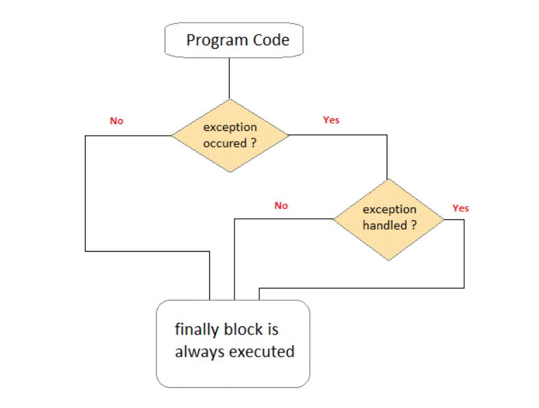

># 'finally' Keyword

A finally keyword is used to create a block of code that follows a try block. A finally block of code is always executed whether an exception has occurred or not. Using a finally block, it lets you run any cleanup type statements that you want to execute, no matter what happens in the protected code. A finally block appears at the end of catch block. For example closing file streams or network streams.



The finally clause is optional. However, each try statement requires at least
one catch or a finally clause.

##### [Example 01](../20-Examples/13-Exception-Handling/05-finally-Keyword/Example-01/)

```java
// Demonstrate finally.
class FinallyDemo {
    // Throw an exception out of the method.
    static void procA() {
        try {
            System.out.println("inside procA");
            throw new RuntimeException("demo");
        } finally {
            System.out.println("procA's finally");
        }
    }
    // Return from within a try block.
    static void procB() {
        try {
            System.out.println("inside procB");
            return;
        } finally {
            System.out.println("procB's finally");
        }
    }
    // Execute a try block normally.
    static void procC() {
        try {
            System.out.println("inside procC");
        } finally {
            System.out.println("procC's finally");
        }
    }
    public static void main(String args[]) {
        try {
            procA();
        } catch (Exception e) {
            System.out.println("Exception caught");
        }
        procB();
        procC();
    }
}
```

In this example, `procA()` prematurely breaks out of the `try` by throwing an exception. The `finally` clause is executed on the way out. `procB()`’s try statement is exited via a `return` statement. The `finally` clause is executed before `procB()` returns. In `procC()`, the try statement executes normally, without error. However, the `finally` block is still executed.

## External Resources

### Youtube Videos

* [ProgrammingKnowledge](https://www.youtube.com/watch?v=nuYdT5q3Gxc&list=PLS1QulWo1RIbfTjQvTdj8Y6yyq4R7g-Al&index=37)
* [Alex Lee](https://www.youtube.com/watch?v=bLGzEqd-ELM&list=PL59LTecnGM1Mg6I4i_KbS0w5bPcDjl7oz&index=21)

### More Examples and Practice Questions

Provided in the last chapter of this section