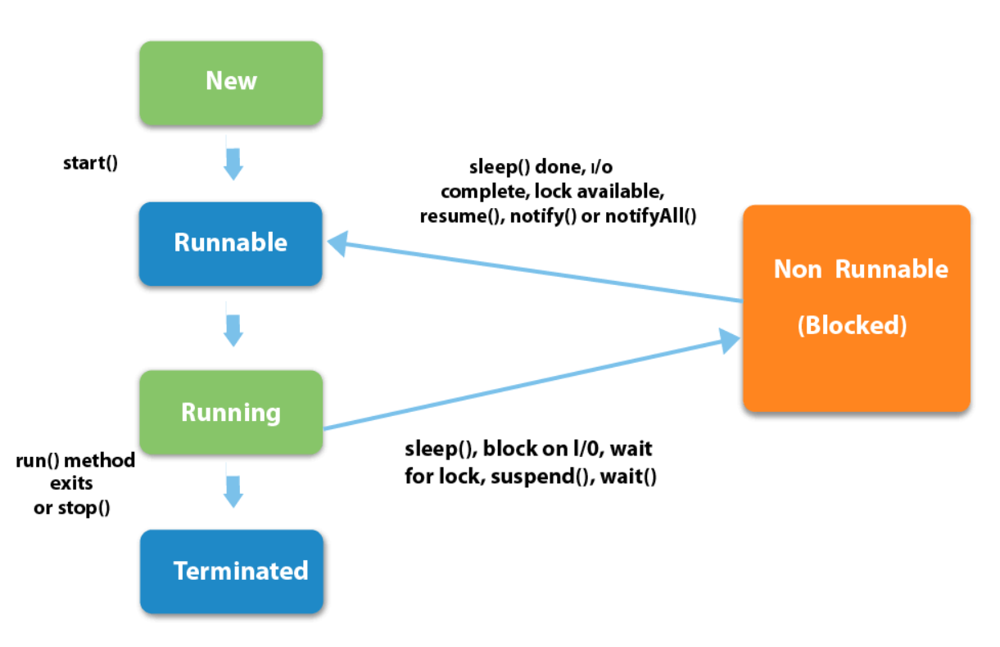

># Process and Threads

A multithreaded program contains two or more parts that can run concurrently. Each part of such a program is called a thread, and each thread defines a separate path of execution. Thus, multithreading is a specialized form of multitasking.

There are two distinct types of multitasking: _process-based_ and _thread-based_.

A _process_ is, in essence, a program that is executing. Thus, _process-based_ multitasking is the feature that allows your computer to run two or more programs concurrently. For example, _process-based_ multitasking enables you to run the Java compiler at the same time that you are using a text editor or visiting a youb site. In process-based multitasking, a program is the smallest unit of code that can be dispatched by the scheduler.

In a _thread-based_ multitasking environment, the _thread_ is the smallest unit of dispatchable code. This means that a single program can perform two or more tasks simultaneously. For instance, a text editor can format text at the same time that it is printing, as long as these two actions are being performed by two separate threads.

## Process VS Thread

|Process|Thread|
|---|---|
|Process means any program is in execution.|Thread means segment of a process.|
|Each process allocates a separate memory area.|Threads share the same address space.
|A process is heavyweight.|A thread is lightweight.|
Ttakes more time for context switching.|Takes less time for context switching.|
|Cost of communication between the process is high.|Cost of communication between the thread is low.|

## Thread Life Cycle

Following are the stages of the life cycle:

__New__: A new thread begins its life cycle in the new state. It remains in this state until the program starts the thread. It is also referred to as a born thread.

__Rannable__: After a newly born thread is started, the thread becomes runnable. A thread in this state is considered to be executing its task.

__Suspended__: A running thread can be suspended, which temporarily suspends its activity. A suspended thread can then be resumed, allowing it to pick up where it left off.

__Blocked__: A java thread can be blocked when waiting for a resource.

__Terminated (Dead)__: A thread can be terminated, which halts its execution immediately at any given time. Once a thread is terminated, it cannot be resumed.

## External Resources

### Readings

* [Oracle Tutorials](https://docs.oracle.com/javase/tutorial/essential/concurrency/procthread.html)
* [JavaTPoint](https://www.javatpoint.com/multithreading-in-java)

### Youtube Videos

* [ProgrammingKnowledge](https://www.youtube.com/watch?v=b5sj13Z7aho&list=PLS1QulWo1RIbfTjQvTdj8Y6yyq4R7g-Al&index=42)

### More Examples and Practice Questions

Provided in the last chapter of current section